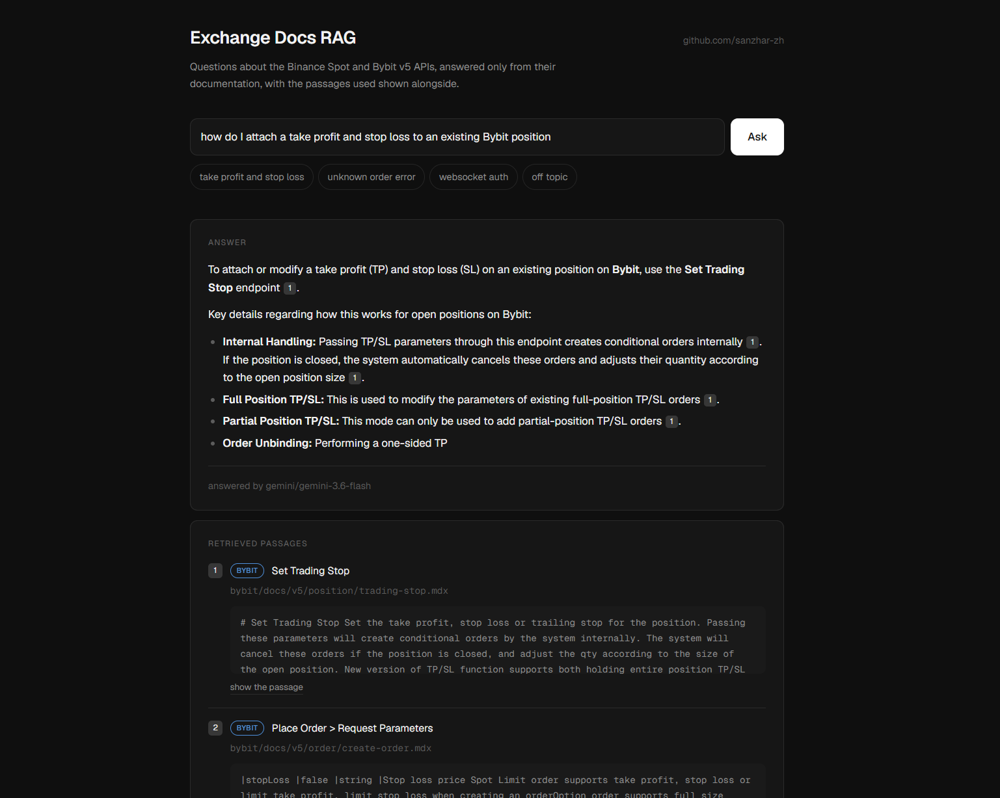

# Exchange Docs RAG

[](https://github.com/sanzhar-zh/exchange-docs-rag/actions/workflows/checks.yml)
[](https://github.com/sanzhar-zh/exchange-docs-rag/actions/workflows/retrieval-quality.yml)

A question-answering assistant over the public API documentation of two crypto
exchanges, Binance Spot and Bybit. Ask in your own words, get an answer grounded
in the documentation with a citation for every claim.



```
$ python ask.py "how do I attach a take profit and stop loss to an existing Bybit position"

To attach a take profit (TP) and stop loss (SL) to an existing position on Bybit,
you use the Set Trading Stop API [1].

*   Internal Order Creation: when you pass TP/SL parameters, the system internally
    creates conditional orders [1].
*   Binding Relationship: if you modify only one side of an existing paired order,
    the orders lose their binding relationship, so cancelling one by its order ID
    no longer cancels the other [1].
*   Partial Position TP/SL: you cannot have more than 20 TP/SL orders under Partial
    mode (Error 110061) [3].
*   Trigger Prices: for linear and inverse contracts you choose the price that
    triggers the orders - MarkPrice, IndexPrice, or the default LastPrice - through
    tpTriggerBy and slTriggerBy [2].

sources  (answered by gemini/gemini-3-flash-preview)
  [1] bybit  bybit/docs/v5/position/trading-stop.mdx
  [2] bybit  bybit/docs/v5/order/create-order.mdx
  [3] bybit  bybit/docs/v5/error.mdx
  [4] bybit  bybit/docs/v5/order/batch-amend.mdx
  [5] bybit  bybit/docs/v5/order/open-order.mdx
```

Abridged for length. Note source [3]: the constraint about 20 partial TP/SL orders
lives on the error-code page, not on the endpoint page, and the answer only reaches
it because retrieval returned both.

This is a good case, not a typical one - measured hit@5 is 0.71, so roughly one
question in four does not get its page into the context at all. The numbers and
what is behind them are below.

I built this because I maintain a trading system that talks to five exchange APIs,
and answering "what is this parameter called on that venue" meant searching five
different documentation sites by hand.

## Why RAG rather than asking a model directly

A language model only knows what was in its training data. Ask it about a specific
endpoint and it will either not know, or recall an outdated version and state it
with the same confidence as a correct answer.

Putting the whole corpus in the prompt does not work either: this documentation is
millions of tokens, it would be paid for on every question, and models retrieve
worse from a large context than from a small relevant one.

So the corpus is indexed once, and each question retrieves only the handful of
passages that bear on it. The model never learns anything; only what is placed in
front of it changes.

## How it works

```
589 documentation files (markdown + Docusaurus mdx)
  |
  |  ingest.py    clean markup, split on headers then by size,
  |               embed locally, deduplicate, persist
  v
4941 chunks in Chroma
  |
  |  search.py    dense (meaning) + BM25 (words), fused by RRF,
  |               pre-filtered by exchange when the question names one
  v
5 passages
  |
  |  ask.py       grounded prompt -> Claude or Gemini -> answer + citations
  v
answer
```

**Embeddings run locally** (`BAAI/bge-small-en-v1.5`, 384 dimensions, CPU). Anthropic
has no embeddings endpoint, so the embedder has to come from somewhere regardless;
keeping it local costs nothing per query and means the corpus never leaves the
machine, which is the usual requirement when the documents belong to a client.

**Generation is provider-agnostic** (`llm.py`). Claude and Gemini are both reached
through the same LangChain interface, chosen by `LLM_PROVIDER` and falling back to
whichever key is present, so a missing key degrades the demo rather than stopping it.

## Measured retrieval quality

Retrieval sets the ceiling: the model can only cite what it is given. So retrieval
is measured on its own, against 89 questions with known correct source pages
(`eval/questions.json`). No model is called, so a run is free and every configuration
can be tried rather than argued about.

- **hit@5** - share of questions where a correct page appears in the top 5
- **MRR** - mean reciprocal rank of the first correct page; rewards ranking it first
  rather than fifth, which hit@5 cannot see

```
89 questions, k=5

config                hit@5     MRR  misses
dense similarity       0.62   0.459      34
dense mmr l=0.7        0.63   0.453      33
keyword bm25           0.54   0.341      41
hybrid rrf_k=1         0.65   0.483      31
hybrid rrf_k=5         0.69   0.534      28
hybrid rrf_k=10        0.71   0.540      26   <- shipped
hybrid rrf_k=60        0.69   0.512      28
```

Reproduce with `python eval/run_eval.py --sweep`. The numbers above were measured
against `binance-spot` at `b8a0f61` and `bybit` at `53ea8fb`; the corpus is cloned
rather than vendored, so `scripts/fetch_docs.py` records what it fetched in
`data/raw/CORPUS.txt`. A page renamed upstream shows up as a permanent miss, which
is worth being able to tell apart from a change here making retrieval worse.

Three changes, each measured on its own, account for the distance from the first
honest baseline. None of them touched the model or the embeddings; all three are
about not feeding noise into the search.

| cumulative change | hit@5 |
|---|---|
| hybrid retrieval with the exchange pre-filter | 0.58 |
| + exclude `changelog/` and Bybit's general `faq.mdx` | 0.63 |
| + drop the exchange name, and the preposition before it, from the query | 0.69 |
| + drop function words from the keyword query | 0.71 |

The second is the least obvious. Once "Bybit" has selected which half of the corpus
to search, searching *for* it is worse than useless: the word runs through that
exchange's overview and marketing pages, which then outrank the endpoint page the
question is about. Deleting the name alone is not enough either - it leaves "how do
I change leverage on", and the embedding of a truncated sentence is worse than
either the whole question or a clean one. Taking the preposition with it was worth
a further two questions.

The third is ordinary information retrieval hygiene that a dense-first mindset
skips: BM25 was scoring documents on "how", "do" and "I", which put an IP changelog
above the leverage reference. IDF discounts common words but not evenly, because
guides are written in prose and reference pages are written in tables.

## What measuring actually changed

Four things I believed from reading the output were wrong, and the eval is the
only reason I know that.

**The first eval set was too small, and it flattered the system.** Twenty-five
questions reported hit@5 of 0.84. Extending the same style of question to 89 put it
at 0.58. Nothing about the system changed; the small set simply happened to hold
easier questions, and one question in twenty-five moves the number four points, so
every comparison I had drawn on it was inside the noise.

**That reversed a conclusion.** On 25 questions hybrid retrieval and dense-only
scored identically, and I wrote hybrid off as not worth its complexity. On 89 it is
ahead by three questions on hit@5 and 0.03 on MRR, consistently across fusion
constants. The effect was real the whole time and the measurement was too coarse to
see it.

**MMR never earned its place.** It is the obvious tool against near-duplicate
results, and I spent longer reasoning about its lambda than about anything else.
With fusion in place it produces identical hit@5 and MRR to three decimals whether
on or off. It is off.

**Keyword search is weaker alone and necessary anyway.** BM25 on its own scores
0.54 against dense's 0.62. It still belongs, because it answers a class dense
retrieval cannot: "what does Binance return when the order does not exist" is
answered by a page carrying that phrase verbatim, which BM25 ranks first and dense
never returns. Fusing the two beats either by eight points.

## Two bugs the numbers exposed

**97% of one corpus was silently missing.** The first ingestion run reported 39
files and finished cleanly. Bybit ships Docusaurus `.mdx`, and the glob matched only
`.md`, so 1189 of 1189 Bybit pages were skipped. Nothing failed; the count was simply
smaller than it should have been.

**Deduplication kept the wrong copy.** Binance mirrors its entire reference under
`testnet/`, and deduplication keeps whichever copy sorts first. `testnet/web-socket-api.md`
sorts before `web-socket-api.md`, so the sandbox documentation was indexed and the
production documentation dropped. Answers about rate limits cited the testnet page,
which is correct-looking and wrong. Both mirrors are now excluded at ingestion.

## Tests and continuous integration

Two workflows, because this project can break in two unrelated ways.

**`checks.yml` runs on every push**: `ruff`, 80 tests, and a type check and build
of the web app. The Python job finishes in about a second, because the tests never
load the index, the embedding model or a provider, and the job installs
`requirements-dev.txt` rather than `requirements.txt` - no torch, 150 MB instead of
a gigabyte.

Almost every test encodes something that actually went wrong here, which is also
why they are worth keeping:

- `.mdx` files are collected, not only `.md`. Matching one suffix indexed 3% of the
  Bybit corpus and reported nothing.
- The production page survives the `testnet/` mirror. Deduplication alone kept
  whichever path sorted first, so the sandbox rate limits were indexed and the
  production ones dropped.
- The preposition leaves with the exchange name. Deleting the name alone left
  "how do I change leverage on", and the correct page fell from rank 1 to rank 9.
- A provider failure is answered with a status code, not an unhandled exception.
  Starlette's 500 handler sits outside the CORS middleware, so the browser
  discarded the response and the page blamed the network for an exhausted quota.

**`retrieval-quality.yml` runs on pull requests that touch retrieval, and weekly.**
It clones the documentation, rebuilds the index and fails the build if hit@5 or MRR
falls below a floor:

```
python eval/run_eval.py --min-hit 0.68 --min-mrr 0.50
```

This is the part the unit tests cannot do. A change to chunking, to the exclusion
rules or to fusion leaves every test passing and can still cost several points of
recall - the code does what it says, and the answers get worse. The floors sit just
below the shipped numbers, so the gate answers whether a change made retrieval
worse rather than whether it moved at all. The weekly run exists because the corpus
is not vendored: the exchanges rewrite their own documentation, and that should be
learned from a scheduled run rather than from a number that has been quietly wrong
for a month.

Locally:

```bash
pip install -r requirements-dev.txt
pytest
ruff check .
```

## Known limitations

- **Better than one question in four still misses, and hit@5 of 0.71 is not good.** The
  failures share a shape: the question uses the words a trader would use and the
  page uses the words the API uses. "Notified when my order gets filled" wants a
  page called *Execution*; "move funds between my accounts" wants *Create Internal
  Transfer*; "cancel my orders if the connection drops" wants *DCP*. Neither arm of
  the search bridges that gap. Rewriting the question into API vocabulary with the
  model before retrieving is the usual remedy and is not implemented here.
- **89 questions is still a small set,** and they are all written by one person who
  knew the corpus, which is its own bias. One question moves hit@5 by a full point.
- **The Gemini free tier runs out quickly.** It is capped per day and per model, and
  preview models get the smallest allowance - twenty requests a day on the one this
  was first pointed at. The endpoint reports an exhausted quota as a 429 with that
  explanation rather than a generic failure, but the fix is to set `GEMINI_MODEL` to
  a non-preview model or to switch `LLM_PROVIDER` to Anthropic. Retrieval and the
  eval are unaffected either way: neither calls a model.
- **The keyword index is rebuilt per process.** At 5k chunks this costs under a
  second. A real deployment would put it in a search engine rather than in memory.
- **Whole-corpus questions are out of scope.** "How many endpoints are there" cannot
  be answered from five passages.
- **The index is rebuilt from scratch on every ingest.** Incremental updates are not
  worth the bookkeeping at this size.
- **Nothing tests the answer, only the retrieval behind it.** Whether the model
  grounds its answer in the passages and cites them correctly is asserted by
  reading the output, not by a grader. Scoring generation needs either a second
  model as judge or hand-written expected answers, and both cost money per run,
  which is why the gate that runs in CI measures retrieval alone.
- **HTML stripping is regex-based.** It suits this corpus, where code samples are
  JSON and Python. It would damage a corpus containing markup inside code blocks.

## Running it

```bash
python -m venv .venv && .venv/Scripts/activate     # Windows
pip install -r requirements.txt

python scripts/fetch_docs.py    # shallow-clones both documentation repos
python ingest.py                # ~3 min, downloads the embedding model once

cp .env.example .env            # add ANTHROPIC_API_KEY or GEMINI_API_KEY
python ask.py "how do I change leverage on Bybit"
```

### Web interface

```bash
uvicorn api:app --port 8000      # backend
cd web && npm install && npm run dev   # frontend on :3000
```

The page shows the answer with citations rendered as chips, and below it every
passage that was retrieved, each expandable to the text the model actually saw.
Showing the passages is the point: a citation number is only trustworthy if the
reader can check what was behind it.

### Inspecting retrieval without spending anything

```bash
python search.py "how do I cancel an order"
python search.py --mode dense "how do I cancel an order"
python search.py --mode keyword "order does not exist"
python eval/run_eval.py --sweep
```

## Layout

| File | Role |
|---|---|
| `ingest.py` | cleaning, splitting, embedding, deduplication |
| `store.py` | shared access to the persisted index |
| `search.py` | dense, keyword and hybrid retrieval; RRF fusion |
| `keyword_search.py` | BM25 index with a tokenizer that splits camelCase and paths |
| `llm.py` | provider selection and fallback |
| `rag.py` | grounded prompt, shared by the CLI and the API |
| `ask.py` | command-line entry point |
| `api.py` | FastAPI service behind the web interface |
| `web/` | Next.js frontend: answer, citations, retrieved passages |
| `eval/` | question set and the measurement harness |
| `tests/` | unit tests: parsing, tokenisation, fusion, the HTTP layer |
| `.github/workflows/` | tests and lint on every push; the retrieval gate on retrieval changes |

The documentation itself is not vendored: `scripts/fetch_docs.py` fetches it, and
`data/` is ignored.
